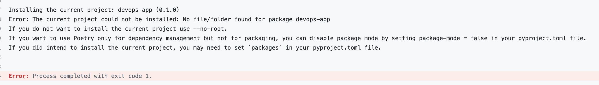
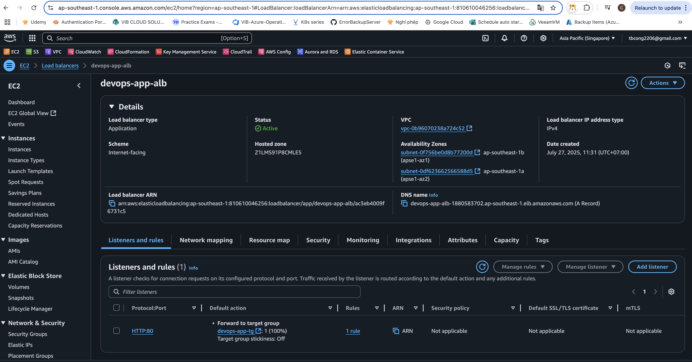
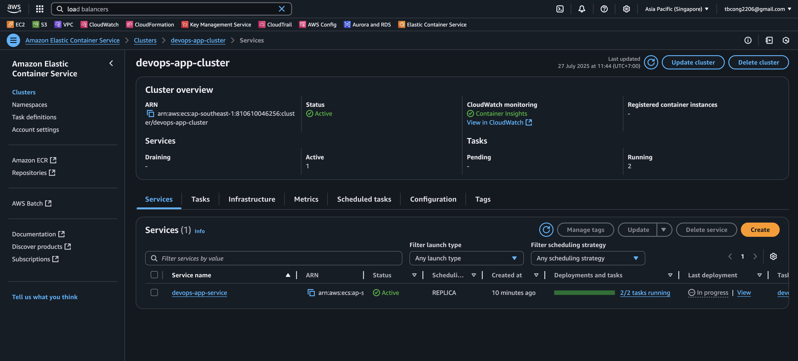
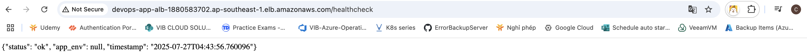

**I.Tổng quan:**<br/>
Mục tiêu là tự động hóa việc xây dựng, kiểm thử và triển khai ứng dụng mẫu được lưu trữ trong kho lưu trữ GitHub công khai lên Amazon Elastic Container Service (ECS) trên AWS. Đường ống sẽ kích hoạt khi đẩy mã lên nhánh chính và triển khai ứng dụng lên https://sample-app.example.com, sử dụng Application Load Balancer (ALB) và chứng chỉ SSL hiện có. Giải pháp này giả định rằng các thành phần cơ sở hạ tầng như VPC, ALB, chứng chỉ SSL và vai trò IAM đã được cung cấp sẵn và có thể được tham chiếu thông qua các biến.

**II.Hạ tầng:**<br/>
Ứng dụng mẫu là một ứng dụng web https://github.com/Everfit-io/devops-test/tree/main với Dockerfile 
Cơ sở hạ tầng AWS có trong lab bao gồm:
VPC và các subnet.
! Phần network chú ý, phải có rule từ các subnet đến ECR để ECS có thể pull image từ ECR
ALB với trình lắng nghe HTTP trên cổng 80
Các vai trò IAM với các quyền cần thiết cho ECS và ECR.
Có kho lưu trữ Amazon ECR để lưu trữ hình ảnh Docker.
! Vì mục đích chính là tạo CI/CD nên tạm thời bỏ qua phần cấu hình SSL

**III.Các rule cần có:**<br/>
Tài khoản AWS: Có quyền quản lý tài nguyên ECS, ECR và ALB.
GitHub: Chứa ứng dụng mẫu với Dockerfile và các tập lệnh kiểm tra.
Terraform
GitHub phải được kết nối với AWS và có rule kết nối đến ECS và ECR để có thể chạy CI/CD
Biến: Giá trị cho VPC ID, ALB ARN hiện có và các tài nguyên được cung cấp sẵn khác.

**IV.Hướng tiếp cận:**<br/>
Việc chạy CI/CD sẽ có 2 giải pháp:<br/>
- AWS Code Pipeline<br/>
- GitHub Action<br/>
Trong bài lab này sẽ dùng GitHub Action. Lý do, code đang ở trên GitHub và cần chạy test CI/CD liên tục. Tuy nhiên nếu trong dự án thực tế thì vẫn ưu tiên AWS Code Pipeline vì lý do bảo mật và khả năng tích hợp với nhiều dịch vụ của AWS<br/>

**V.Triển khai**<br/>
Pipeline sẽ gồm các bước:<br/>
**Step 1: Build và push image lên ECR.**<br/>
Đẩy mã lên nhánh chính để kích hoạt quy trình làm việc GitHub Actions.
Trigger pipeline khi có push hoặc PR lên nhánh main<br/>
```
on:
  push:
    branches: [ main ]
  pull_request:
    branches: [ main ]
```
**Step 2: Run test.**<br/>
```
jobs:
  test:
    name: Run Tests with Docker Compose
    runs-on: ubuntu-latest
    steps:
      - name: Checkout code
        uses: actions/checkout@v4

      - name: Set up Docker Compose
        run: docker compose version

      - name: Run tests
        run: |
          cd devops-app
          docker compose run --rm app poetry install --no-root
          docker compose run --rm app poetry run pytest -v
```

Mục đích: Đảm bảo code compile, dependencies ổn, tests sạch sẽ trước khi build image.<br/>
- runs-on: Chạy trên runner Ubuntu hosted của GitHub.<br/>
- Checkout code: Lấy toàn bộ source về runner.<br/>
- Set up Docker Compose: Kiểm tra Docker Compose đã cài (đảm bảo có sẵn).<br/>
  Run tests:<br/>
- cd devops-app: chuyển vào thư mục chứa docker-compose.yml.<br/>
- docker compose run --rm app poetry install --no-root: build image service app theo Compose, chỉ cài dependencies (bỏ install project).<br/>
- docker compose run --rm app poetry run pytest -v: chạy bộ test với pytest bên trong container.<br/>
- --rm đảm bảo container test bị xóa sau khi chạy xong, đảm bảo CI luôn test trên môi trường mới<br/>
- Thêm flag --no-root để chỉ cài dependencies mà không cài package gốc để tránh lỗi packaging<br/>


**Step 3: Build và Push**<br/>
```
  build-and-push:
    name: Build and Push Docker Image to ECR
    needs: test
    runs-on: ubuntu-latest
    permissions:
      id-token: write
      contents: read
    steps:
      - name: Checkout code
        uses: actions/checkout@v4
  
      - name: Configure AWS credentials
        uses: aws-actions/configure-aws-credentials@v2
        with:
          role-to-assume: arn:aws:iam::810610046256:role/GitHubOIDCDeployRole
          aws-region: ap-southeast-1 
  
      - name: Login to Amazon ECR
        uses: aws-actions/amazon-ecr-login@v2
  
      - name: Build and Push Docker Image to ECR
        env:
          ECR_REGISTRY: 810610046256.dkr.ecr.ap-southeast-1.amazonaws.com
          ECR_REPOSITORY: test
          IMAGE_TAG: ${{ github.sha }}
        run: |
          cd devops-app
          docker build -t $ECR_REGISTRY/$ECR_REPOSITORY:$IMAGE_TAG -t $ECR_REGISTRY/$ECR_REPOSITORY:latest .
          docker push $ECR_REGISTRY/$ECR_REPOSITORY:$IMAGE_TAG
          docker push $ECR_REGISTRY/$ECR_REPOSITORY:latest
```
Mục đích: Build image từ code đã test, push lên ECR để sẵn sàng deploy.<br/>
- needs: test: Chỉ chạy khi job test đã thành công. <br/>
  permissions:<br/>
- id-token: write cho phép sử dụng OIDC token để assume IAM Role.<br/>
- contents: read để checkout code.<br/>
  Configure AWS credentials:<br/>
- Sử dụng [aws-actions/configure-aws-credentials@v2] để assume IAM Role qua GitHub OIDC (không cần store AWS keys).<br/>
- role-to-assume: ARN của IAM Role bạn đã tạo cho GitHub Actions.<br/>
- Login to Amazon ECR: Dùng action aws-actions/amazon-ecr-login@v2 để login Docker client vào ECR.<br/>
  Build & Push:<br/>
  env:<br/>
  - ECR_REGISTRY: URL registry ECR.<br/>
  - ECR_REPOSITORY: tên repo trong ECR.<br/>
  - IMAGE_TAG: commit SHA làm tag version.<br/>
  - Gắn 2 tag: SHA và latest. <br/>
    - Tag latest: Tiện lợi cho auto deploy<br/>
    - Tag SHA: Dùng để debug, audit, và rollback về đúng commit đã deploy.<br/>

**Step 4: Deploy**<br/>
```
deploy:
    name: Deploy to Amazon ECS
    needs: build-and-push
    runs-on: ubuntu-latest
    permissions:
      id-token: write
      contents: read
    if: github.ref == 'refs/heads/main' && github.event_name == 'push'
    steps:
      - name: Checkout code
        uses: actions/checkout@v4
  
      - name: Configure AWS credentials
        uses: aws-actions/configure-aws-credentials@v2
        with:
          role-to-assume: arn:aws:iam::810610046256:role/GitHubOIDCDeployRole
          aws-region: ap-southeast-1
  
      - name: Update ECS service
        run: |
          aws ecs update-service \
            --cluster devops-app-cluster \
            --service devops-app-service \
            --force-new-deployment
```
Mục đích: Triển khai lên ECS<br/>
- needs: build-and-push: Chỉ deploy khi build-and-push thành công.<br/>
- if: github.ref...: Chỉ chạy job này khi push trên main. Tuy nhiên trong dự án thực tế thì sẽ thay đổi điều kiện chỗ này<br/>
- Configure AWS credentials: Tương tự job build, để có quyền gọi AWS CLI.<br/>
  Update ECS service:<br/>
- Dùng aws ecs update-service --force-new-deployment để:<br/>
- Bắt ECS service khởi chạy lại tasks mới nhất (với image latest).<br/>
- Task cũ sẽ dừng dần khi task mới ổn định.<br/>


Kết quả:<br/>



